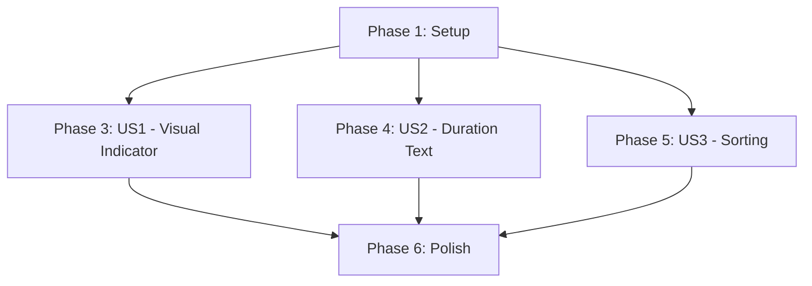

# Tasks: Overdue Todo Items Support

**Feature**: 001-overdue-todos
**Generated**: 2025-12-12
**Total Tasks**: 31

## Overview

Implementation tasks for adding overdue visual indicators, duration text, and optional sorting to the todo app. All changes are frontend-only using native JavaScript Date API and React patterns.

## Phase 1: Setup

**Goal**: Create project structure for utilities and tests

- [X] T001 Create utils directory in packages/frontend/src/
- [X] T002 Create __tests__ directory in packages/frontend/src/utils/

## Phase 2: Foundational Tasks

**Goal**: No foundational tasks required - feature uses existing infrastructure

_(This phase is empty because the feature has no shared dependencies between user stories. Each story is independent.)_

## Phase 3: User Story 1 - Visual Overdue Indicator (P1)

**Story Goal**: Display a warning badge/icon next to incomplete todos that are past their due date

**Independent Test**: Create todos with past, current, and future due dates. Verify badge appears only for incomplete todos with past due dates.

### Tests First (TDD - RED)

- [X] T003 [P] [US1] Write test for isOverdue() with overdue incomplete todo in packages/frontend/src/utils/__tests__/dateUtils.test.js
- [X] T004 [P] [US1] Write test for isOverdue() with future due date in packages/frontend/src/utils/__tests__/dateUtils.test.js
- [X] T005 [P] [US1] Write test for isOverdue() with today's due date in packages/frontend/src/utils/__tests__/dateUtils.test.js
- [X] T006 [P] [US1] Write test for isOverdue() with null due date in packages/frontend/src/utils/__tests__/dateUtils.test.js
- [X] T007 [P] [US1] Write test for isOverdue() with completed overdue todo in packages/frontend/src/utils/__tests__/dateUtils.test.js
- [X] T008 [US1] Run tests to verify RED state (all fail) for packages/frontend/src/utils/__tests__/dateUtils.test.js

### Implementation (TDD - GREEN)

- [X] T009 [US1] Create dateUtils.js with isOverdue() function using native Date API in packages/frontend/src/utils/dateUtils.js
- [X] T010 [US1] Implement date-only comparison logic (reset hours to midnight) in packages/frontend/src/utils/dateUtils.js
- [X] T011 [US1] Run tests to verify GREEN state (all pass) for packages/frontend/src/utils/__tests__/dateUtils.test.js

### Component Tests (TDD - RED)

- [X] T012 [P] [US1] Write test for badge appearing on overdue incomplete todo in packages/frontend/src/components/__tests__/TodoCard.test.js
- [X] T013 [P] [US1] Write test for badge NOT appearing on completed overdue todo in packages/frontend/src/components/__tests__/TodoCard.test.js
- [X] T014 [P] [US1] Write test for badge NOT appearing on future due date in packages/frontend/src/components/__tests__/TodoCard.test.js
- [X] T015 [P] [US1] Write test for badge NOT appearing when no due date in packages/frontend/src/components/__tests__/TodoCard.test.js
- [X] T016 [US1] Run tests to verify RED state for packages/frontend/src/components/__tests__/TodoCard.test.js

### Component Implementation (TDD - GREEN)

- [X] T017 [US1] Import isOverdue from dateUtils in packages/frontend/src/components/TodoCard.js
- [X] T018 [US1] Add overdue calculation in TodoCard component in packages/frontend/src/components/TodoCard.js
- [X] T019 [US1] Add conditional rendering for warning badge/icon next to checkbox in packages/frontend/src/components/TodoCard.js
- [X] T020 [US1] Add CSS styling for overdue badge with danger color in packages/frontend/src/components/TodoCard.js
- [X] T021 [US1] Run tests to verify GREEN state for packages/frontend/src/components/__tests__/TodoCard.test.js

### Refactor

- [X] T022 [US1] Review and refactor code for clarity and DRY principle in packages/frontend/src/utils/dateUtils.js and packages/frontend/src/components/TodoCard.js

## Phase 4: User Story 2 - Overdue Duration Text (P2)

**Story Goal**: Display human-readable text indicating how long a todo has been overdue (e.g., "3 days overdue", "2 weeks overdue")

**Independent Test**: Create todos with varying overdue durations (1 day, 10 days, 45 days). Verify correct unit conversion (days → weeks → months).

### Tests First (TDD - RED)

- [ ] T023 [P] [US2] Write test for formatOverdueDuration() with 1 day overdue in packages/frontend/src/utils/__tests__/dateUtils.test.js
- [ ] T024 [P] [US2] Write test for formatOverdueDuration() with 5 days overdue in packages/frontend/src/utils/__tests__/dateUtils.test.js
- [ ] T025 [P] [US2] Write test for formatOverdueDuration() with 14 days (2 weeks) overdue in packages/frontend/src/utils/__tests__/dateUtils.test.js
- [ ] T026 [P] [US2] Write test for formatOverdueDuration() with 45 days (1 month) overdue in packages/frontend/src/utils/__tests__/dateUtils.test.js
- [ ] T027 [P] [US2] Write test for formatOverdueDuration() edge case at 7 days boundary in packages/frontend/src/utils/__tests__/dateUtils.test.js
- [ ] T028 [P] [US2] Write test for formatOverdueDuration() edge case at 30 days boundary in packages/frontend/src/utils/__tests__/dateUtils.test.js
- [ ] T029 [US2] Run tests to verify RED state for packages/frontend/src/utils/__tests__/dateUtils.test.js

### Implementation (TDD - GREEN)

- [ ] T030 [US2] Implement formatOverdueDuration() function with day/week/month logic in packages/frontend/src/utils/dateUtils.js
- [ ] T031 [US2] Add unit auto-switching logic: <7 days use days, 7-29 use weeks, 30+ use months in packages/frontend/src/utils/dateUtils.js
- [ ] T032 [US2] Handle singular/plural forms (day/days, week/weeks, month/months) in packages/frontend/src/utils/dateUtils.js
- [ ] T033 [US2] Run tests to verify GREEN state for packages/frontend/src/utils/__tests__/dateUtils.test.js

### Component Tests (TDD - RED)

- [ ] T034 [P] [US2] Write test for duration text appearing on overdue todo in packages/frontend/src/components/__tests__/TodoCard.test.js
- [ ] T035 [P] [US2] Write test for duration text showing correct format (e.g., "3 days overdue") in packages/frontend/src/components/__tests__/TodoCard.test.js
- [ ] T036 [P] [US2] Write test for duration text NOT appearing on non-overdue todo in packages/frontend/src/components/__tests__/TodoCard.test.js
- [ ] T037 [US2] Run tests to verify RED state for packages/frontend/src/components/__tests__/TodoCard.test.js

### Component Implementation (TDD - GREEN)

- [ ] T038 [US2] Import formatOverdueDuration from dateUtils in packages/frontend/src/components/TodoCard.js
- [ ] T039 [US2] Add conditional rendering for duration text below due date in packages/frontend/src/components/TodoCard.js
- [ ] T040 [US2] Add CSS styling for overdue duration text (small, muted) in packages/frontend/src/components/TodoCard.js
- [ ] T041 [US2] Run tests to verify GREEN state for packages/frontend/src/components/__tests__/TodoCard.test.js

### Refactor

- [ ] T042 [US2] Review and refactor code for readability in packages/frontend/src/utils/dateUtils.js and packages/frontend/src/components/TodoCard.js

## Phase 5: User Story 3 - Overdue Sorting Option (P3)

**Story Goal**: Provide optional sorting to show overdue todos at the top of the list, with persistence across sessions

**Independent Test**: Create mix of overdue and non-overdue todos. Toggle sorting option and verify overdue items appear first, with preference persisting after page reload.

### Tests First (TDD - RED)

- [ ] T043 [P] [US3] Write test for sorting overdue todos before non-overdue in packages/frontend/src/components/__tests__/TodoList.test.js
- [ ] T044 [P] [US3] Write test for sorting multiple overdue todos by most overdue first in packages/frontend/src/components/__tests__/TodoList.test.js
- [ ] T045 [P] [US3] Write test for maintaining original order within non-overdue todos in packages/frontend/src/components/__tests__/TodoList.test.js
- [ ] T046 [P] [US3] Write test for completed todos NOT appearing as overdue after sorting in packages/frontend/src/components/__tests__/TodoList.test.js
- [ ] T047 [US3] Run tests to verify RED state for packages/frontend/src/components/__tests__/TodoList.test.js

### Implementation (TDD - GREEN)

- [ ] T048 [US3] Add sort toggle state to TodoList component in packages/frontend/src/components/TodoList.js
- [ ] T049 [US3] Implement sorting comparator function using isOverdue() in packages/frontend/src/components/TodoList.js
- [ ] T050 [US3] Apply conditional Array.sort() based on toggle state in packages/frontend/src/components/TodoList.js
- [ ] T051 [US3] Run tests to verify GREEN state for packages/frontend/src/components/__tests__/TodoList.test.js

### LocalStorage Persistence Tests (TDD - RED)

- [ ] T052 [P] [US3] Write test for saving sort preference to localStorage in packages/frontend/src/components/__tests__/TodoList.test.js
- [ ] T053 [P] [US3] Write test for loading sort preference from localStorage on mount in packages/frontend/src/components/__tests__/TodoList.test.js
- [ ] T054 [US3] Run tests to verify RED state for packages/frontend/src/components/__tests__/TodoList.test.js

### LocalStorage Implementation (TDD - GREEN)

- [ ] T055 [US3] Add localStorage.getItem() on component mount in packages/frontend/src/components/TodoList.js
- [ ] T056 [US3] Add localStorage.setItem() when toggle changes in packages/frontend/src/components/TodoList.js
- [ ] T057 [US3] Run tests to verify GREEN state for packages/frontend/src/components/__tests__/TodoList.test.js

### UI Tests (TDD - RED)

- [ ] T058 [P] [US3] Write test for sort toggle button rendering in packages/frontend/src/components/__tests__/TodoList.test.js
- [ ] T059 [P] [US3] Write test for toggle button changing state on click in packages/frontend/src/components/__tests__/TodoList.test.js
- [ ] T060 [US3] Run tests to verify RED state for packages/frontend/src/components/__tests__/TodoList.test.js

### UI Implementation (TDD - GREEN)

- [ ] T061 [US3] Add sort toggle button/checkbox UI in packages/frontend/src/components/TodoList.js
- [ ] T062 [US3] Add onChange handler to update sort state in packages/frontend/src/components/TodoList.js
- [ ] T063 [US3] Add CSS styling for sort toggle control in packages/frontend/src/components/TodoList.js
- [ ] T064 [US3] Run tests to verify GREEN state for packages/frontend/src/components/__tests__/TodoList.test.js

### Refactor

- [ ] T065 [US3] Review and refactor sorting logic for clarity in packages/frontend/src/components/TodoList.js
- [ ] T066 [US3] Extract localStorage logic to separate utility functions if needed in packages/frontend/src/utils/storageUtils.js (optional)

## Phase 6: Polish & Cross-Cutting Concerns

**Goal**: Final code quality, documentation, and cross-story validation

- [ ] T067 [P] Run all tests to verify 80%+ code coverage across feature
- [ ] T068 [P] Add JSDoc comments to all utility functions in packages/frontend/src/utils/dateUtils.js
- [ ] T069 [P] Verify accessibility (aria-labels on badges, keyboard navigation)
- [ ] T070 [P] Test dark/light mode compatibility for overdue colors
- [ ] T071 Manual test: Create todos with various due dates and verify all scenarios from spec.md
- [ ] T072 Manual test: Verify overdue updates on page load/refresh
- [ ] T073 Manual test: Verify sorting toggle persists across browser sessions
- [ ] T074 Code review: Verify all code follows coding-guidelines.md conventions
- [ ] T075 Code review: Verify no console.log statements remain
- [ ] T076 Update documentation if needed (README.md or feature docs)

## Dependencies

### User Story Completion Order



**Completion Order**:
1. **Phase 1 (Setup)** → MUST complete first
2. **Phase 3 (US1), Phase 4 (US2), Phase 5 (US3)** → Can be implemented in parallel (no dependencies)
3. **Phase 6 (Polish)** → Complete after all user stories

**Key Insights**:
- User stories are **completely independent** after Setup
- US2 builds on US1 UI-wise but doesn't block implementation
- US3 is standalone and can be implemented/tested separately
- MVP delivery: Just US1 (Visual Indicator) provides core value

### Parallel Execution Opportunities

#### Phase 3 (US1) - Can parallelize:
```bash
# Tests can be written in parallel:
T003-T007 [P] - All dateUtils.test.js tests (different test cases)
T012-T015 [P] - All TodoCard.test.js tests (different scenarios)

# Sequential within story:
T008 → T009-T011 → T016 → T017-T021 → T022
```

#### Phase 4 (US2) - Can parallelize:
```bash
# Tests can be written in parallel:
T023-T028 [P] - All dateUtils.test.js duration tests
T034-T036 [P] - All TodoCard.test.js duration tests

# Sequential within story:
T029 → T030-T033 → T037 → T038-T041 → T042
```

#### Phase 5 (US3) - Can parallelize:
```bash
# Tests can be written in parallel:
T043-T046 [P] - TodoList.test.js sorting tests
T052-T053 [P] - TodoList.test.js localStorage tests
T058-T059 [P] - TodoList.test.js UI tests

# Sequential within story:
T047 → T048-T051 → T054 → T055-T057 → T060 → T061-T064 → T065-T066
```

#### Phase 6 (Polish) - Can parallelize:
```bash
# All polish tasks can run in parallel:
T067, T068, T069, T070 [P]

# Manual tests are sequential:
T071 → T072 → T073 → T074 → T075 → T076
```

## Implementation Strategy

### MVP Scope (Minimum Viable Product)

**Recommendation**: Implement **User Story 1 (Phase 3) only** for initial release

**MVP Tasks**: T001-T022 (22 tasks)

**Rationale**:
- Delivers core value: Users can immediately identify overdue todos
- Independently testable and deployable
- Low risk, high impact
- Builds foundation for P2/P3 enhancements

**MVP Success Criteria**:
- Visual badge appears on overdue incomplete todos
- Badge does NOT appear on completed or future-due todos
- All tests pass with 80%+ coverage
- Dark/light mode compatible

### Incremental Delivery Plan

**Release 1** (MVP): Phase 1 + Phase 3 (US1)
- Setup + Visual Indicator
- Estimated: 2-3 hours
- Value: Basic overdue awareness

**Release 2**: Add Phase 4 (US2)
- Duration text
- Estimated: +1 hour
- Value: Enhanced context (how overdue)

**Release 3**: Add Phase 5 (US3)
- Sorting option
- Estimated: +2 hours
- Value: Workflow optimization for power users

**Release 4**: Phase 6 (Polish)
- Final quality checks
- Documentation updates
- Estimated: +1 hour

### Testing Strategy

**Test-First Approach** (TDD):
1. Write failing test (RED)
2. Write minimal code to pass (GREEN)
3. Refactor for quality
4. Repeat

**Coverage Targets**:
- Overall: 80%+
- dateUtils.js: 100% (pure functions, easily testable)
- TodoCard.js: 85%+ (conditional rendering)
- TodoList.js: 85%+ (sorting logic)

**Test Types**:
- Unit tests: All utility functions (isOverdue, formatOverdueDuration)
- Component tests: All React components (TodoCard, TodoList)
- Integration: Manual testing per Phase 6 checklist
- Edge cases: Boundary conditions (7 days, 30 days, midnight, completed status)

## Validation

### Format Validation

✅ All tasks follow checklist format: `- [ ] T### [P?] [Story?] Description with file path`
✅ Task IDs sequential: T001-T076
✅ Story labels present: [US1], [US2], [US3] in appropriate phases
✅ Parallel markers: [P] on independent tasks
✅ File paths: All tasks include specific file paths

### Completeness Validation

✅ Each user story has complete TDD cycle (tests → implementation → refactor)
✅ Each user story has independent test criteria
✅ All functional requirements covered (FR-001 through FR-010)
✅ All acceptance scenarios from spec.md covered
✅ Setup and polish phases included

### Constitution Compliance

✅ Principle I (Test-First): All tasks follow RED→GREEN→REFACTOR
✅ Principle II (Single Responsibility): Utilities, components, storage separated
✅ Principle III (Code Consistency): Naming conventions in task descriptions
✅ Principle IV (DRY): Centralized utilities, no duplication
✅ Principle V (KISS): Native APIs, simple patterns
✅ Principle VI (Independent Stories): All 3 user stories independently deliverable

## Summary

- **Total Tasks**: 76
- **Setup**: 2 tasks
- **Foundational**: 0 tasks (none needed)
- **User Story 1 (P1)**: 20 tasks
- **User Story 2 (P2)**: 20 tasks
- **User Story 3 (P3)**: 24 tasks
- **Polish**: 10 tasks

- **Parallel Opportunities**: 26 tasks marked [P] (34% parallelizable)
- **Independent Test Criteria**: All 3 user stories independently testable
- **MVP Scope**: 22 tasks (US1 only)
- **Estimated Total Effort**: 4-5 hours
- **Risk Level**: Low (frontend-only, no dependencies, clear tests)

---

**Next Step**: Begin implementation with `T001` (Create utils directory) or jump to MVP with Phase 1 + Phase 3.
